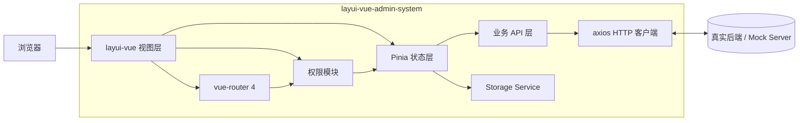
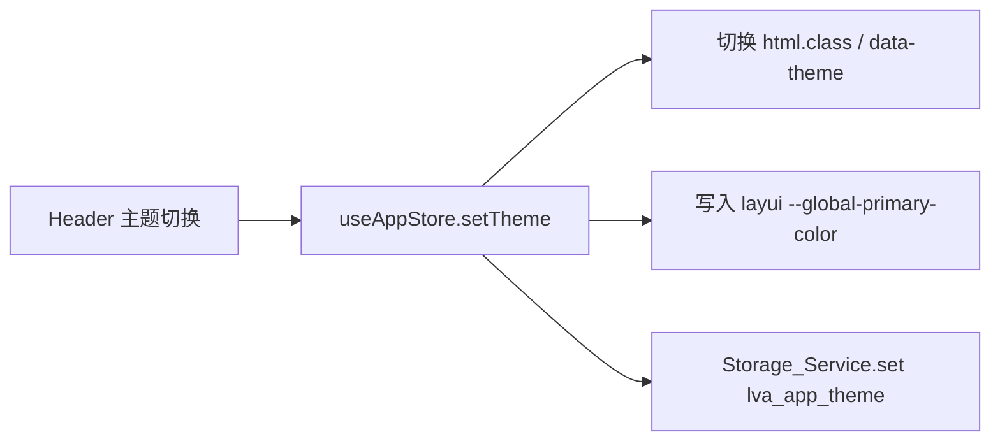
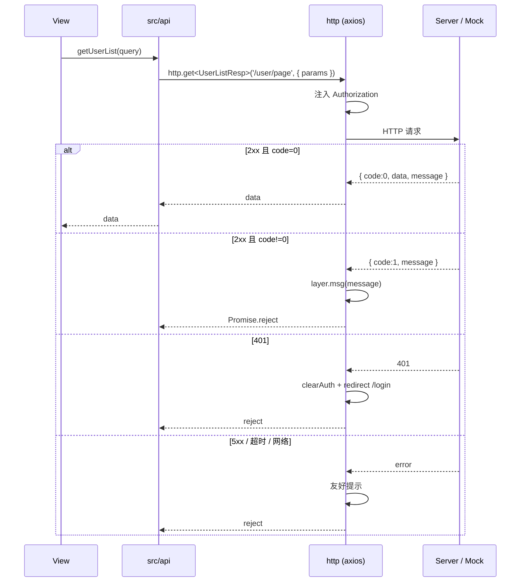
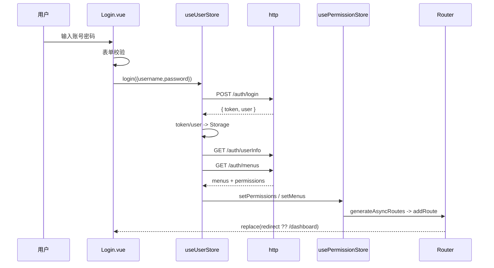
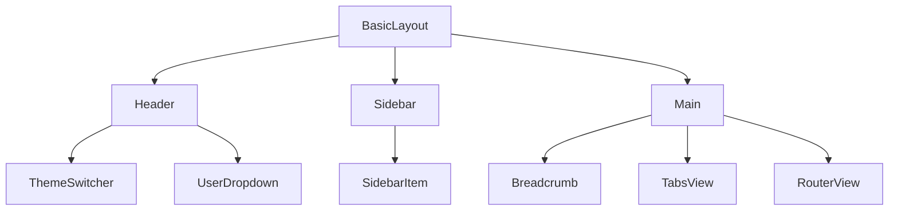
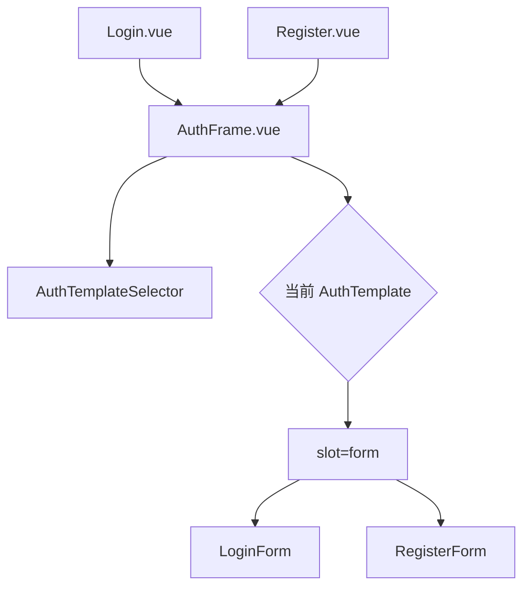
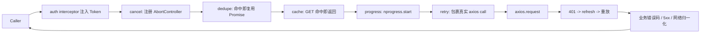

# Design Document

## Overview

本设计文档面向 `layui-vue-admin-system` 后台管理系统脚手架，目标是在 Vue 3 + TypeScript + Vite + layui-vue 技术栈基础上，提供一套结构清晰、可二次开发、内置 Mock 服务与按需自动导入能力的通用后台管理脚手架。

设计原则：

- **类型先行**：所有跨模块的数据结构（用户、角色、菜单、权限、API 响应）以 TypeScript 接口集中定义，业务层、Store 层、视图层共享同一份类型契约。
- **职责分层**：视图（views/components/layouts）— 状态（Pinia stores）— 业务 API（src/api）— 通信（src/utils/http）— 持久化（src/utils/storage） 五层分明，单向依赖。
- **Mock 与真实接口同构**：`mock/*.ts` 中的接口路径、请求体、响应壳与生产期一致，开发者切换 `VITE_USE_MOCK` 即可在本地 Mock 与真实后端之间无缝切换。
- **声明式权限**：菜单/路由/按钮三级权限统一以「权限码（Permission_Code）」为最小单位；按钮级以指令 `v-permission` 与工具函数 `hasPermission` 二合一表达。
- **可观测的失败**：HTTP 错误、运行时错误、未授权访问、路由 404/403/500 都收敛到统一的 `Error_Handler`，便于排错与扩展。

整体范围：



## Architecture

### 1. 技术栈与依赖清单（含版本范围）

| 类别 | 依赖 | 版本范围 | 用途 |
| --- | --- | --- | --- |
| 框架 | `vue` | `^3.4.0` | 视图框架 |
| 框架 | `vue-router` | `^4.4.0` | 路由（history 模式） |
| 框架 | `pinia` | `^2.2.0` | 全局状态管理 |
| UI | `@layui/layui-vue` | `^2.x` | 组件库（按官方入门文档） |
| UI | `@layui/icons-vue` | `^1.x` | 图标 |
| 构建 | `vite` | `^5.x` | 构建/开发服务器 |
| 构建 | `@vitejs/plugin-vue` | `^5.x` | Vue 单文件支持 |
| 构建 | `vite-plugin-mock` | `^3.x` | 本地 Mock 服务 |
| 构建 | `unplugin-auto-import` | `^0.18.x` | API 自动导入 |
| 构建 | `@layui/unplugin-vue-components` | `^0.27.x` | layui-vue 按需注册 |
| 网络 | `axios` | `^1.7.x` | HTTP 客户端 |
| 工具 | `mockjs` | `^1.1.x` | Mock 数据生成 |
| 工具 | `nprogress` | `^0.2.x` | 顶部进度条 |
| 类型 | `typescript` | `^5.4.x` | 类型系统 |
| 类型 | `vue-tsc` | `^2.x` | `.vue` 类型检查 |
| 质量 | `eslint` | `^9.x` | 代码检查 |
| 质量 | `eslint-plugin-vue` | `^9.x` | Vue 规则 |
| 质量 | `@typescript-eslint/parser` | `^8.x` | TS 解析 |
| 质量 | `@typescript-eslint/eslint-plugin` | `^8.x` | TS 规则 |
| 质量 | `prettier` | `^3.x` | 格式化 |
| 测试 | `vitest` | `^2.x` | 单元/属性测试运行器 |
| 测试 | `@vue/test-utils` | `^2.x` | 组件测试 |
| 测试 | `fast-check` | `^3.x` | 属性测试库 |
| 测试 | `jsdom` | `^25.x` | 浏览器环境模拟 |

具体版本以项目实施时锁定的 `package-lock.json` 为准。

### 2. 项目目录结构

```
layui-vue3-admin-ts/
├── .env.development              # 开发环境变量（VITE_USE_MOCK=true 等）
├── .env.production               # 生产环境变量（VITE_USE_MOCK=false）
├── .env.example                  # 环境变量模板
├── .eslintrc.cjs                 # ESLint 配置
├── .eslintignore                 # 排除自动生成的 d.ts
├── .prettierrc.cjs               # Prettier 配置
├── .prettierignore               # 排除自动生成的 d.ts
├── .gitignore
├── LICENSE                       # MIT
├── README.md                     # 中文说明（含双仓地址）
├── index.html
├── package.json
├── tsconfig.json                 # 严格模式 + include auto d.ts
├── tsconfig.node.json
├── vite.config.ts                # 见「Vite 配置设计」
├── vitest.config.ts              # 单元 / 属性测试配置
├── mock/                         # Mock 服务（TS）
│   ├── _utils.ts                 # 响应壳/分页/鉴权工具
│   ├── _data/                    # 静态数据（用户、角色、菜单等）
│   │   ├── users.ts
│   │   ├── roles.ts
│   │   ├── menus.ts
│   │   └── permissions.ts
│   ├── auth.ts                   # 登录/登出/getUserInfo/getUserMenus
│   ├── user.ts                   # 用户分页/增/改/删/重置密码
│   ├── role.ts                   # 角色分页/增/改/删/分配权限
│   ├── menu.ts                   # 菜单分页/树/增/改/删
│   └── dashboard.ts              # 四个统计接口
├── public/
│   └── favicon.ico
└── src/
    ├── api/                      # 业务 API 层（按模块）
    │   ├── auth.ts
    │   ├── user.ts
    │   ├── role.ts
    │   ├── menu.ts
    │   └── dashboard.ts
    ├── assets/
    │   ├── images/
    │   └── logo.svg
    ├── components/               # 跨模块通用组件
    │   ├── PermissionTree/
    │   ├── SearchForm/
    │   ├── PageTable/
    │   └── IconSelect/
    ├── directives/
    │   └── permission.ts         # v-permission 指令
    ├── hooks/
    │   ├── useTable.ts
    │   └── useDialog.ts
    ├── layouts/
    │   ├── BasicLayout.vue       # 主布局
    │   ├── components/
    │   │   ├── Header.vue
    │   │   ├── Sidebar.vue
    │   │   ├── SidebarItem.vue
    │   │   ├── Breadcrumb.vue
    │   │   ├── TabsView.vue
    │   │   ├── ThemeSwitcher.vue
    │   │   └── UserDropdown.vue
    │   └── BlankLayout.vue       # /login 等无壳布局
    ├── router/
    │   ├── index.ts              # createRouter + 守卫
    │   ├── routes.static.ts      # 静态路由（/login、/403、/404、/500、/redirect）
    │   ├── routes.async.ts       # 动态路由表（按权限码筛选）
    │   ├── guard.ts              # 守卫实现
    │   └── title.ts              # 标题更新器
    ├── store/                    # Pinia 全局状态
    │   ├── index.ts              # createPinia + 持久化
    │   ├── modules/
    │   │   ├── user.ts           # useUserStore
    │   │   ├── permission.ts     # usePermissionStore
    │   │   └── app.ts            # useAppStore（主题/侧栏/标签页）
    │   └── persist.ts            # 与 Storage_Service 对接
    ├── styles/
    │   ├── index.scss
    │   ├── variables.scss        # 主色/暗黑变量
    │   ├── theme-light.scss
    │   ├── theme-dark.scss
    │   └── reset.scss
    ├── types/
    │   ├── api.d.ts              # ApiResponse / Pagination
    │   ├── domain.d.ts           # User/Role/Menu/Permission
    │   ├── env.d.ts              # ImportMetaEnv
    │   ├── auto-imports.d.ts     # 自动生成（不手写）
    │   └── components.d.ts       # 自动生成（不手写）
    ├── utils/
    │   ├── http.ts               # axios 实例 + 拦截器
    │   ├── storage.ts            # Storage_Service
    │   ├── permission.ts         # hasPermission 工具
    │   ├── theme.ts              # CSS 变量切换
    │   └── error-handler.ts      # 全局错误归一化
    ├── views/
    │   ├── login/
    │   │   └── index.vue
    │   ├── dashboard/
    │   │   └── index.vue
    │   ├── system/
    │   │   ├── user/
    │   │   │   ├── index.vue
    │   │   │   └── components/UserFormDialog.vue
    │   │   ├── role/
    │   │   │   ├── index.vue
    │   │   │   ├── components/RoleFormDialog.vue
    │   │   │   └── components/RolePermissionDialog.vue
    │   │   └── menu/
    │   │       ├── index.vue
    │   │       └── components/MenuFormDialog.vue
    │   └── error/
    │       ├── 403.vue
    │       ├── 404.vue
    │       └── 500.vue
    ├── App.vue
    └── main.ts
```

### 3. Vite 配置设计

`vite.config.ts` 集中处理：路径别名、开发服务器端口、环境变量加载、Mock 启停、自动导入与按需组件注册。下列代码即为最终落地版本：

```ts
// vite.config.ts
import { defineConfig, loadEnv } from 'vite'
import vue from '@vitejs/plugin-vue'
import path from 'node:path'
import AutoImport from 'unplugin-auto-import/vite'
import Components from '@layui/unplugin-vue-components/vite'
import { LayuiVueResolver } from '@layui/unplugin-vue-components/resolvers'
import { viteMockServe } from 'vite-plugin-mock'

export default defineConfig(({ command, mode }) => {
  const env = loadEnv(mode, process.cwd(), 'VITE_')
  const useMock = env.VITE_USE_MOCK === 'true'

  return {
    base: env.VITE_PUBLIC_PATH || '/',
    resolve: {
      alias: {
        '@': path.resolve(__dirname, 'src'),
      },
    },
    server: {
      host: '0.0.0.0',
      port: Number(env.VITE_PORT) || 5173,
      open: false,
      proxy: useMock
        ? undefined
        : {
            '/api': {
              target: env.VITE_API_BASE_URL,
              changeOrigin: true,
              rewrite: (p) => p.replace(/^\/api/, ''),
            },
          },
    },
    plugins: [
      vue(),
      AutoImport({
        imports: ['vue', 'vue-router', 'pinia'],
        resolvers: [LayuiVueResolver()],
        dts: 'src/types/auto-imports.d.ts',
        eslintrc: { enabled: true, filepath: './.eslintrc-auto-import.json' },
      }),
      Components({
        resolvers: [LayuiVueResolver()],
        dts: 'src/types/components.d.ts',
        dirs: ['src/components'],
      }),
      viteMockServe({
        mockPath: 'mock',
        enable: command === 'serve' && useMock,
        watchFiles: true,
        logger: true,
      }),
    ],
    build: {
      outDir: 'dist',
      sourcemap: false,
      target: 'es2020',
      chunkSizeWarningLimit: 1500,
    },
  }
})
```

环境变量约定（`.env.*`）：

| 变量 | development | production | 说明 |
| --- | --- | --- | --- |
| `VITE_USE_MOCK` | `true` | `false` | 开关 vite-plugin-mock |
| `VITE_API_BASE_URL` | `/api` | `https://your-domain/api` | HTTP 基础地址 |
| `VITE_PORT` | `5173` | — | 开发端口 |
| `VITE_PUBLIC_PATH` | `/` | `/` 或子路径 | 资源前缀 |

`tsconfig.json` 关键片段（确保自动生成 d.ts 纳入类型解析）：

```json
{
  "compilerOptions": {
    "strict": true,
    "baseUrl": ".",
    "paths": { "@/*": ["src/*"] }
  },
  "include": [
    "src/**/*",
    "src/**/*.vue",
    "src/types/auto-imports.d.ts",
    "src/types/components.d.ts"
  ]
}
```

`.eslintignore` / `.prettierignore`：

```
src/types/auto-imports.d.ts
src/types/components.d.ts
.eslintrc-auto-import.json
```

### 4. 主题与 CSS 变量架构

主题切换基于「CSS 变量 + body 类名」双轨：

- 所有可定制颜色集中到 `:root` 与 `:root.dark`，业务样式只引用变量。
- 切换主题时，`useAppStore.setTheme()` 修改 `<html>` 的 `class` 与 `data-theme` 属性，同时调用 `setLayuiCssVar(primary)` 写入 layui-vue 的主色变量（如 `--global-primary-color`）。
- 主色与主题持久化到 `Storage_Service`（key：`lva_app_theme`、`lva_app_primary`），下次启动在 `main.ts` 同步阶段读取并应用，避免「白屏闪烁」。



## Components and Interfaces

### 1. Mock 服务设计（vite-plugin-mock + TypeScript）

**目录与职责**：

```
mock/
├── _utils.ts          # ok / fail / unauthorized / paginate / requireToken / parseBody
├── _data/             # 长生命期内存数据
│   ├── users.ts       # 含 admin / user 预置账号
│   ├── roles.ts       # Super_Admin、Basic_User
│   ├── menus.ts       # 树形菜单
│   └── permissions.ts # 权限码全集
├── auth.ts
├── user.ts
├── role.ts
├── menu.ts
└── dashboard.ts
```

**统一响应壳**（与真实接口一致）：

```ts
// mock/_utils.ts
import type { MockMethod } from 'vite-plugin-mock'

export interface ApiResponse<T> {
  code: number
  data: T
  message: string
}

export const ok = <T>(data: T, message = 'ok'): ApiResponse<T> => ({
  code: 0,
  data,
  message,
})

export const fail = (message: string, code = 1): ApiResponse<null> => ({
  code,
  data: null,
  message,
})

export const unauthorized = () => ({
  code: 401,
  data: null,
  message: '未登录或登录已过期',
})

export interface PageQuery {
  page?: number
  pageSize?: number
}
export interface PageResult<T> {
  list: T[]
  total: number
  page: number
  pageSize: number
}

export const paginate = <T>(rows: T[], q: PageQuery): PageResult<T> => {
  const page = Math.max(1, Number(q.page) || 1)
  const pageSize = Math.max(1, Number(q.pageSize) || 10)
  const start = (page - 1) * pageSize
  return { list: rows.slice(start, start + pageSize), total: rows.length, page, pageSize }
}

// 解析 GET query 与 POST/PUT/DELETE body
export const parseQuery = (url: string): Record<string, string> => {
  const i = url.indexOf('?')
  if (i < 0) return {}
  return Object.fromEntries(new URLSearchParams(url.slice(i + 1)))
}

export const parseBody = <T = any>(req: any): T => req?.body ?? {}

// 鉴权门卫：除登录外所有 mock 接口必须带 token
export const requireToken = (req: any): boolean => {
  const auth = req.headers?.authorization || req.headers?.Authorization
  if (!auth) return false
  const token = String(auth).replace(/^Bearer\s+/i, '')
  return token.startsWith('mock-token-')
}

export const guard =
  (handler: (req: any) => any) =>
  (req: any) => {
    if (!requireToken(req)) return unauthorized()
    return handler(req)
  }

export type Method = 'get' | 'post' | 'put' | 'delete'
export type Mock = MockMethod
```

**预置账号与权限**：

```ts
// mock/_data/users.ts
export const presetUsers = [
  {
    id: 1,
    username: 'admin',
    password: '123456',
    nickname: '超级管理员',
    roleCodes: ['Super_Admin'],
    status: 1,
  },
  {
    id: 2,
    username: 'user',
    password: '123456',
    nickname: '普通用户',
    roleCodes: ['Basic_User'],
    status: 1,
  },
]
```

`Super_Admin` 在 `permissions.ts` 中映射到「全部权限码」，`Basic_User` 仅 `dashboard:view`、`user:view` 等基础查看权限。

**接口清单（节选）**：

| 路径 | 方法 | 处理 |
| --- | --- | --- |
| `/api/auth/login` | POST | 校验账号密码，签发 `mock-token-<userId>-<ts>` |
| `/api/auth/logout` | POST | guard，返回 ok |
| `/api/auth/userInfo` | GET | guard，依据 token 解析返回 |
| `/api/auth/menus` | GET | guard，返回该用户的菜单 + 权限码 |
| `/api/user/page` | GET | guard，分页 + 关键字过滤 |
| `/api/user` | POST/PUT/DELETE | guard，CRUD |
| `/api/user/{id}/reset-password` | POST | guard，重置为 `123456` |
| `/api/role/page` | GET | guard，分页 |
| `/api/role/{id}/permissions` | PUT | guard，保存角色权限 |
| `/api/menu/tree` | GET | guard，返回完整菜单树 |
| `/api/dashboard/stats` | GET | guard，四个统计 |

### 2. HTTP 客户端设计

```ts
// src/utils/http.ts
import axios, { type AxiosInstance, type AxiosRequestConfig } from 'axios'
import { layer } from '@layui/layui-vue'
import { useUserStore } from '@/store/modules/user'
import router from '@/router'
import type { ApiResponse } from '@/types/api'

const instance: AxiosInstance = axios.create({
  baseURL: import.meta.env.VITE_API_BASE_URL,
  timeout: 15000,
})

instance.interceptors.request.use((config) => {
  const userStore = useUserStore()
  if (userStore.token) {
    config.headers.Authorization = `Bearer ${userStore.token}`
  }
  return config
})

instance.interceptors.response.use(
  (res) => {
    const body = res.data as ApiResponse<unknown>
    if (body && typeof body.code === 'number') {
      if (body.code === 0) return body
      // 业务错误：提示 + reject
      layer.msg(body.message || '请求失败', { icon: 2 })
      return Promise.reject(body)
    }
    return res.data
  },
  (err) => {
    const status = err?.response?.status
    if (status === 401) {
      const userStore = useUserStore()
      userStore.clearAuth()
      router.replace({ path: '/login', query: { redirect: router.currentRoute.value.fullPath } })
      layer.msg('未登录或登录已过期', { icon: 2 })
    } else if (status >= 500) {
      layer.msg('服务异常，请稍后重试', { icon: 2 })
    } else if (err.code === 'ECONNABORTED') {
      layer.msg('请求超时，请稍后重试', { icon: 2 })
    } else if (!err.response) {
      layer.msg('网络异常，请检查网络连接', { icon: 2 })
    } else {
      layer.msg(err?.response?.data?.message || '请求失败', { icon: 2 })
    }
    return Promise.reject(err)
  },
)

export const http = {
  get<T>(url: string, config?: AxiosRequestConfig) {
    return instance.get<unknown, ApiResponse<T>>(url, config).then((r) => r.data)
  },
  post<T>(url: string, data?: unknown, config?: AxiosRequestConfig) {
    return instance.post<unknown, ApiResponse<T>>(url, data, config).then((r) => r.data)
  },
  put<T>(url: string, data?: unknown, config?: AxiosRequestConfig) {
    return instance.put<unknown, ApiResponse<T>>(url, data, config).then((r) => r.data)
  },
  delete<T>(url: string, config?: AxiosRequestConfig) {
    return instance.delete<unknown, ApiResponse<T>>(url, config).then((r) => r.data)
  },
}
```

请求/响应流程：



### 3. Storage Service 设计

```ts
// src/utils/storage.ts
type Driver = 'local' | 'session'
const PREFIX = 'lva_'

const drivers: Record<Driver, Storage> = {
  local: window.localStorage,
  session: window.sessionStorage,
}

const k = (key: string) => `${PREFIX}${key}`

export const storage = {
  get<T>(key: string, driver: Driver = 'local'): T | null {
    const raw = drivers[driver].getItem(k(key))
    if (raw === null) return null
    try {
      return JSON.parse(raw) as T
    } catch (e) {
      if (import.meta.env.DEV) console.warn('[storage] parse error', key, e)
      return null
    }
  },
  set<T>(key: string, value: T, driver: Driver = 'local'): void {
    drivers[driver].setItem(k(key), JSON.stringify(value))
  },
  remove(key: string, driver: Driver = 'local'): void {
    drivers[driver].removeItem(k(key))
  },
  clear(driver: Driver = 'local'): void {
    const s = drivers[driver]
    const keys: string[] = []
    for (let i = 0; i < s.length; i++) {
      const k0 = s.key(i)
      if (k0 && k0.startsWith(PREFIX)) keys.push(k0)
    }
    keys.forEach((k0) => s.removeItem(k0))
  },
}
```

约定的 key：

| Key | 介质 | 内容 |
| --- | --- | --- |
| `lva_token` | local | 登录令牌 |
| `lva_user_info` | local | 当前用户信息 |
| `lva_app_theme` | local | `'light' \| 'dark'` |
| `lva_app_primary` | local | 主色 hex |
| `lva_app_sidebar_collapsed` | local | 是否收起 |
| `lva_app_tabs` | session | 标签页缓存 |

### 4. 认证与权限流

**登录序列**：



**路由守卫流程**：

```mermaid
flowchart TD
  A[beforeEach to/from] --> B{to.path == /login?}
  B -- 是 --> Z[next()]
  B -- 否 --> C{有 token?}
  C -- 否 --> D[next /login?redirect=to.fullPath]
  C -- 是 --> E{permissionStore 已初始化?}
  E -- 否 --> F[拉取 userInfo + menus + 注册动态路由]
  F --> G[next to.fullPath replace]
  E -- 是 --> H{路由存在?}
  H -- 否 --> I[next /404]
  H -- 是 --> J{需要权限码?}
  J -- 否 --> Z
  J -- 是 --> K{hasPermission?}
  K -- 是 --> Z
  K -- 否 --> L[next /403]
```

**`v-permission` 指令**：

```ts
// src/directives/permission.ts
import type { Directive } from 'vue'
import { hasPermission } from '@/utils/permission'

export const permission: Directive<HTMLElement, string | string[]> = {
  mounted(el, binding) {
    if (!hasPermission(binding.value)) {
      el.parentNode?.removeChild(el)
    }
  },
  updated(el, binding) {
    if (!hasPermission(binding.value)) {
      el.parentNode?.removeChild(el)
    }
  },
}
```

**`hasPermission` 工具**：

```ts
// src/utils/permission.ts
import { useUserStore } from '@/store/modules/user'

export const SUPER_ADMIN_CODE = 'Super_Admin'

export function hasPermission(code: string | string[]): boolean {
  if (!code || (Array.isArray(code) && code.length === 0)) return true
  const store = useUserStore()
  if (store.roles.includes(SUPER_ADMIN_CODE)) return true
  const owned = store.permissions
  const need = Array.isArray(code) ? code : [code]
  return need.some((c) => owned.includes(c))
}
```

> 设计点：`hasPermission` 对 `Super_Admin` 永真；对空入参返回 `true`（允许「无权限要求」的元素显示）；数组入参采用「任一命中即通过」。

### 5. 布局设计

`BasicLayout.vue` 负责整体骨架，子组件通过 `useAppStore` 共享状态：



行为约定：

- **响应式折叠**：监听 `window.matchMedia('(max-width: 768px)')`，命中即调用 `useAppStore.setSidebarCollapsed(true)`，并切换为「抽屉式」覆盖布局。
- **手动折叠**：Header 的折叠按钮直接 toggle Store 状态；展开宽度 `240px`，收起 `64px`。
- **面包屑**：基于 `route.matched` 过滤 `meta.title` 存在的层级。
- **多标签页**：以 `route.fullPath` 为唯一键存入 `useAppStore.tabs`；切换路由时 push；点击「关闭」按钮：
  - 仅一个标签时不渲染关闭按钮。
  - 关闭非激活标签：仅删除该项。
  - 关闭激活标签：删除后自动切换到右侧第一个标签，若无则切换到左侧第一个。

### 6. 路由设计

**静态路由**（始终注册）：

```ts
// src/router/routes.static.ts
export const staticRoutes: RouteRecordRaw[] = [
  { path: '/login', component: () => import('@/views/login/index.vue'), meta: { title: '登录' } },
  { path: '/403', component: () => import('@/views/error/403.vue'), meta: { title: '无权限' } },
  { path: '/404', component: () => import('@/views/error/404.vue'), meta: { title: '页面不存在' } },
  { path: '/500', component: () => import('@/views/error/500.vue'), meta: { title: '服务异常' } },
  {
    path: '/redirect/:path(.*)',
    component: () => import('@/views/redirect/index.vue'),
    meta: { title: '重定向' },
  },
  { path: '/:pathMatch(.*)*', redirect: '/404' },
]
```

**动态路由表**（包裹在 `BasicLayout` 下）：

```ts
// src/router/routes.async.ts
export const asyncRoutes: RouteRecordRaw[] = [
  {
    path: '/',
    component: BasicLayout,
    redirect: '/dashboard',
    children: [
      {
        path: 'dashboard',
        component: () => import('@/views/dashboard/index.vue'),
        meta: { title: '仪表盘', icon: 'layui-icon-home', permission: 'dashboard:view' },
      },
      {
        path: 'system',
        meta: { title: '系统管理', icon: 'layui-icon-set' },
        children: [
          {
            path: 'user',
            component: () => import('@/views/system/user/index.vue'),
            meta: { title: '用户管理', permission: 'user:view' },
          },
          {
            path: 'role',
            component: () => import('@/views/system/role/index.vue'),
            meta: { title: '角色管理', permission: 'role:view' },
          },
          {
            path: 'menu',
            component: () => import('@/views/system/menu/index.vue'),
            meta: { title: '菜单管理', permission: 'menu:view' },
          },
        ],
      },
    ],
  },
]
```

**Route Meta 类型**：

```ts
declare module 'vue-router' {
  interface RouteMeta {
    title: string
    icon?: string
    permission?: string | string[]
    keepAlive?: boolean
    hidden?: boolean
  }
}
```

**标题更新器**：`router.afterEach((to) => { document.title = to.meta.title ? \`${to.meta.title} - layui-vue Admin\` : 'layui-vue Admin' })`。

**重置路由**：登出时遍历当前 router 中由 `addRoute` 引入的根路径，逐一 `removeRoute`，再重新注册静态路由，确保动态路由完全清除。

### 7. 状态管理设计（Pinia）

```ts
// src/store/modules/user.ts
export const useUserStore = defineStore('user', {
  state: () => ({
    token: storage.get<string>('token') ?? '',
    userInfo: storage.get<User>('user_info') ?? null,
    roles: [] as string[],
    permissions: [] as string[],
  }),
  actions: {
    async login(payload: LoginRequest) { /* 调 /auth/login */ },
    async fetchUserInfo() { /* 调 /auth/userInfo */ },
    async fetchUserMenus() { /* 调 /auth/menus，返回 menus + permissions */ },
    clearAuth() {
      this.token = ''
      this.userInfo = null
      this.roles = []
      this.permissions = []
      storage.remove('token')
      storage.remove('user_info')
    },
    async logout() { /* 调 /auth/logout 后 clearAuth + 重置路由 */ },
  },
})
```

```ts
// src/store/modules/permission.ts
export const usePermissionStore = defineStore('permission', {
  state: () => ({ menus: [] as Menu[], asyncRoutes: [] as RouteRecordRaw[], inited: false }),
  actions: {
    generateRoutes(menus: Menu[], permissions: string[], roles: string[]) {
      const filtered = filterAsyncRoutes(asyncRoutes, permissions, roles)
      this.asyncRoutes = filtered
      this.menus = menus
      this.inited = true
      filtered.forEach((r) => router.addRoute(r))
    },
    reset() {
      this.menus = []
      this.asyncRoutes = []
      this.inited = false
    },
  },
})
```

```ts
// src/store/modules/app.ts
export const useAppStore = defineStore('app', {
  state: () => ({
    theme: storage.get<'light' | 'dark'>('app_theme') ?? 'light',
    primary: storage.get<string>('app_primary') ?? '#16baaa',
    sidebarCollapsed: storage.get<boolean>('app_sidebar_collapsed') ?? false,
    tabs: [] as TabItem[],
  }),
  actions: {
    setTheme(t: 'light' | 'dark') { /* 写 DOM + Storage */ },
    setPrimary(c: string) { /* 写 CSS 变量 + Storage */ },
    setSidebarCollapsed(v: boolean) { /* 写 Storage */ },
    addTab(tab: TabItem) { /* 去重后 push */ },
    closeTab(fullPath: string) { /* 删除 + 计算下一激活 */ },
  },
})
```

### 8. 业务模块拆解

每个业务模块统一遵循「API → Store/View → Dialog」三层：

#### 8.1 用户管理（`/system/user`）

- **API（`src/api/user.ts`）**：`getUserPage(q)`、`createUser(p)`、`updateUser(p)`、`deleteUser(id)`、`resetUserPassword(id)`。
- **视图组成**：`SearchForm`（账号/昵称/状态）+ `lay-table` 列表 + 分页 + `UserFormDialog`。
- **行级控制**：当前登录用户自身行隐藏「删除」（基于 `useUserStore.userInfo.id` 比对）。
- **校验**：账号 `^[A-Za-z0-9_]{4,20}$`；昵称 1–20；初始密码 6–20。
- **重置密码**：`layer.confirm` 二次确认 → 调 `resetUserPassword` → `layer.msg('已重置为默认密码 123456')`。

#### 8.2 角色管理（`/system/role`）

- **API**：`getRolePage`、`createRole`、`updateRole`、`deleteRole`、`getRolePermissions(id)`、`saveRolePermissions(id, codes)`。
- **视图组成**：列表 + `RoleFormDialog` + `RolePermissionDialog`（包裹 `PermissionTree`）。
- **业务规则**：角色编码全局唯一，前端在新增/编辑保存前不强行去重，由接口返回业务错误码 `40010`，视图捕获并定位到字段。
- **删除约束**：若接口返回 `40020`「角色被引用」，提示「该角色正在被使用，无法删除」。

#### 8.3 菜单管理（`/system/menu`）

- **API**：`getMenuTree`、`createMenu`、`updateMenu`、`deleteMenu(id)`。
- **视图组成**：`lay-tree-table` + `MenuFormDialog`。
- **类型分支**：
  - `directory`：仅校验名称、图标、排序，无需路由路径与组件路径但允许填写。
  - `menu`：必填路由路径与组件路径；权限码可选。
  - `button`：必填权限码，路由路径与组件路径置空且不参与校验。
- **保存后**：除刷新菜单树外，同步触发 `useUserStore.fetchUserMenus()` 重建左侧导航。
- **删除前置**：当前节点存在 `children.length > 0` 时本地先拦截，提示「请先删除其子节点」，避免无效请求。

## Data Models

```ts
// src/types/api.d.ts
export interface ApiResponse<T> {
  code: number
  data: T
  message: string
}

export interface PageQuery {
  page: number
  pageSize: number
  keyword?: string
}

export interface PageResult<T> {
  list: T[]
  total: number
  page: number
  pageSize: number
}
```

```ts
// src/types/domain.d.ts
export type Status = 0 | 1 // 0 禁用，1 启用

export interface User {
  id: number
  username: string
  nickname: string
  avatar?: string
  email?: string
  phone?: string
  status: Status
  roleCodes: string[]   // 角色编码集合（外键到 Role.code）
  createdAt: string
  updatedAt?: string
}

export interface UserCreateRequest {
  username: string
  nickname: string
  password: string
  roleCodes: string[]
  status: Status
}

export interface UserUpdateRequest extends Omit<UserCreateRequest, 'password'> {
  id: number
}

export interface Role {
  id: number
  code: string          // 唯一
  name: string
  description?: string
  status: Status
  createdAt: string
}

export interface Permission {
  code: string          // 例如 user:create
  name: string
  type: 'menu' | 'button' | 'api'
}

export type MenuType = 'directory' | 'menu' | 'button'

export interface Menu {
  id: number
  parentId: number | null
  name: string
  icon?: string
  type: MenuType
  path?: string         // type=directory|menu 时必填
  component?: string    // type=menu 时必填
  permission?: string   // type=button 时必填
  sort: number
  visible: boolean
  children?: Menu[]
}

export interface LoginRequest {
  username: string
  password: string
}

export interface LoginResponse {
  token: string
  user: User
}

export interface UserMenusResponse {
  menus: Menu[]
  permissions: string[]
  roles: string[]
}

export interface TabItem {
  fullPath: string
  title: string
  closable: boolean
}
```

```ts
// src/types/env.d.ts
interface ImportMetaEnv {
  readonly VITE_USE_MOCK: 'true' | 'false'
  readonly VITE_API_BASE_URL: string
  readonly VITE_PORT?: string
  readonly VITE_PUBLIC_PATH?: string
}
interface ImportMeta {
  readonly env: ImportMetaEnv
}
```


## Correctness Properties

> 属性（Property）是系统在所有合法执行下都应保持的特征或行为，是规约与可机器验证的正确性保证之间的桥梁。下列每条属性均以「For any …」形式表达，可由 `vitest + fast-check` 编写为属性测试，并在每次回归中以最少 100 次随机迭代覆盖。

### Property 1: Logout 永远清空认证态并回到登录页

*For any* 已登录的会话状态（任意非空 token、任意 user 对象、任意当前路由），调用 `useUserStore.logout()` 之后：

- `useUserStore.token === ''`
- `useUserStore.userInfo === null`
- `storage.get('token') === null` 且 `storage.get('user_info') === null`
- 当前路由 `path === '/login'`

**Validates: Requirements 2.7**

### Property 2: 任意端点收到 HTTP 401 触发统一登出

*For any* 请求 URL `u` 与请求方法 `m`，当 axios 实例针对该请求收到 HTTP 401 响应时，响应拦截器执行后必须满足：

- `useUserStore.token === ''`
- 路由发生过一次 `router.replace`，目标 `path === '/login'` 且 `query.redirect` 为发起请求时的 `currentRoute.fullPath`
- 调用方收到 `Promise.reject`

**Validates: Requirements 2.9, 3.5**

### Property 3: Storage JSON 往返保持等价

*For any* 非空字符串 key `k` 与任意 JSON 兼容值 `v`（包含 null、boolean、有限 number、字符串、数组、对象的递归组合，排除 `undefined`、函数、循环引用、`Date`），先 `storage.set(k, v)` 再 `storage.get<typeof v>(k)` 必须深度等于 `v`，且 `storage.remove(k)` 之后 `storage.get(k) === null`。同时此属性涵盖主题 / 主色等所有持久化字段（11.3 由本属性覆盖）。

**Validates: Requirements 13.2, 11.3**

### Property 4: 反序列化异常静默返回 null

*For any* 字符串 `s`，若 `s` 不是合法 JSON，则在底层 `localStorage.setItem(prefix+key, s)` 后调用 `storage.get(key)` 必须返回 `null` 且不抛出异常。

**Validates: Requirements 13.4**

### Property 5: v-permission 的 DOM 可见性与 hasPermission 等价

*For any* 当前用户角色集合 `roles`、权限码集合 `owned`、以及指令绑定值 `code`（字符串或字符串数组），将一个含 `v-permission="code"` 的元素挂载后：

- 若 `hasPermission(code)` 为 `true`，则该元素在 DOM 中存在且 `parentNode` 仍为原父节点；
- 若 `hasPermission(code)` 为 `false`，则该元素已从 DOM 中移除；
- 在 `updated` 钩子重复触发同一权限上下文时结果保持不变（幂等）。

**Validates: Requirements 10.1, 10.2**

### Property 6: Super_Admin 通过任意权限校验

*For any* 字符串或字符串数组 `code`（含空数组、特殊字符串），若 `useUserStore.roles.includes('Super_Admin')`，则 `hasPermission(code) === true`。

**Validates: Requirements 10.4**

### Property 7: 路由守卫决策表恒定

*For any* 目标路径 `to`、token 状态 `hasToken`、白名单集合 `whitelist`、已注册路径集合 `registered`、目标路由所需权限 `required`、当前用户拥有权限 `owned` 与角色 `roles`，纯函数 `decideNavigation(...)` 的返回必须满足：

- 若 `to ∈ whitelist`：`{ type: 'pass' }`；
- 否则若 `!hasToken`：`{ type: 'redirect', path: '/login', query: { redirect: to } }`；
- 否则若 `to ∉ registered`：`{ type: 'redirect', path: '/404' }`；
- 否则若 `required` 非空且 `hasPermission(required, owned, roles) === false`：`{ type: 'redirect', path: '/403' }`；
- 否则：`{ type: 'pass' }`。

且对任意输入决策结果与上述分支顺序完全一致（不存在二义）。

**Validates: Requirements 2.8, 5.4, 5.5, 5.7**

### Property 8: Mock 助手与鉴权门卫不变量

*For any* 数组 `rows: T[]` 与查询 `(page, pageSize)`（任意整数，函数内部归一化为 `≥1`）：

- `paginate(rows, q).total === rows.length`；
- `paginate(rows, q).list.length ≤ pageSize`；
- 对任意 `rows`，遍历 `page = 1..ceil(total/pageSize)` 拼接得到的 `list` 严格等于 `rows`（覆盖与有序）；
- `ok(d).code === 0`、`fail(m).code !== 0`、`unauthorized().code === 401`，且 `data` 字段始终存在；
- *For any* 请求头 `headers`，`requireToken({ headers })` 为 `true` 当且仅当存在 `Authorization`/`authorization` 字段且其值在去除 `Bearer ` 前缀后以 `mock-token-` 起始；`guard(handler)` 在 `requireToken` 为 `false` 时不调用 `handler` 且返回 `unauthorized()` 壳。

**Validates: Requirements 16.4, 16.5, 16.7**

### Property 9: 多标签页关闭归约的一致性

将 `useAppStore.closeTab` 抽出为纯函数 `closeTabReducer(tabs, activePath, closingPath)`。*For any* 非空 `tabs`、`activePath ∈ tabs.fullPath`、`closingPath ∈ tabs.fullPath`，结果 `(tabs', activePath')` 必须满足：

- `tabs'.length === max(tabs.length - 1, 1)`；当且仅当 `tabs.length === 1` 时返回与输入完全一致（不允许关闭最后一个）；
- `closingPath ∉ tabs'.fullPath`（除非 `tabs.length === 1`）；
- 若 `closingPath !== activePath`：`activePath' === activePath`；
- 若 `closingPath === activePath` 且存在右邻居：`activePath'` 等于关闭前 `closingPath` 的右邻居；否则等于左邻居；
- UI 助手 `isCloseVisible(tabs)` 在 `tabs.length === 1` 时为 `false`，否则为 `true`。

**Validates: Requirements 4.7, 4.8**

### Property 10: 行级删除按钮可见性等价

*For any* 用户列表 `rows: User[]` 与当前登录 `currentUserId: number`，纯函数 `canDeleteRow(row, currentUserId)` 必须满足 `canDeleteRow(row, id) === (row.id !== id)`，且对列表的渲染输出中「显示删除」的元素集合恰好为 `{ row | row.id !== currentUserId }`。

**Validates: Requirements 7.10**

## Error Handling

错误统一归口到 `src/utils/error-handler.ts` 与 HTTP 拦截器，分类与处理策略如下表。

| 错误类别 | 触发条件 | 归一化检测 | 用户提示 | 副作用 |
| --- | --- | --- | --- | --- |
| 网络异常 | `!err.response && err.code !== 'ECONNABORTED'` | 浏览器无响应、断网 | `网络异常，请检查网络连接` | `Promise.reject(err)`，无路由跳转 |
| 请求超时 | `err.code === 'ECONNABORTED'` | axios 默认 15s（登录 10s） | `请求超时，请稍后重试`；登录页特化为 `登录请求超时，请稍后重试` | `reject` |
| 未登录 / 失效 | `status === 401` | 服务端或 Mock 返回 401 | `未登录或登录已过期` | `useUserStore.clearAuth()`、`router.replace('/login?redirect=…')` |
| 无权限 | `status === 403` 或路由守卫命中 | 接口或路由元信息 | `没有权限访问该资源` | 路由守卫场景跳 `/403` |
| 资源不存在 | `status === 404` 或路径未注册 | — | `资源不存在` | 路由守卫场景跳 `/404` |
| 服务器异常 | `status >= 500` | 5xx | `服务异常，请稍后重试` | 可选跳 `/500` |
| 业务错误 | `code !== 0` | 响应壳 | 后端 `message` 直显 | `Promise.reject(body)`，调用方按需补充处理 |
| 运行时未捕获 | `app.config.errorHandler` | Vue 模板/渲染错误 | `页面发生异常，请刷新重试` | DEV 打印原始 `error.stack`，PROD 仅提示 |

```ts
// src/main.ts (片段)
import { createApp } from 'vue'
import App from './App.vue'
import { setupErrorHandler } from '@/utils/error-handler'

const app = createApp(App)
setupErrorHandler(app)

// src/utils/error-handler.ts
import type { App } from 'vue'
import { layer } from '@layui/layui-vue'

export function setupErrorHandler(app: App) {
  app.config.errorHandler = (err, _instance, info) => {
    if (import.meta.env.DEV) {
      console.error('[GlobalError]', info, err)
    }
    layer.msg('页面发生异常，请刷新重试', { icon: 2 })
  }
  window.addEventListener('unhandledrejection', (e) => {
    if (import.meta.env.DEV) console.error('[UnhandledRejection]', e.reason)
  })
}
```

异常页（403 / 404 / 500）三视图共享统一壳：左侧插画 + 错误码 + 描述 + 「返回首页」按钮（`router.replace('/dashboard')`）。

## Testing Strategy

本项目采用「单元测试 + 属性测试 + 端到端冒烟」三层组合，重点放在前两层。

### 1. 工具与运行器

- **运行器**：`vitest`（jsdom 环境）。
- **属性测试库**：`fast-check`，每条属性最少 100 次迭代（`fc.assert(prop, { numRuns: 100 })`），生成失败时 vitest 输出最小反例。
- **组件测试**：`@vue/test-utils`，用于 `v-permission` 指令与布局类组件。
- **HTTP Mock**：`axios-mock-adapter`，对响应拦截器与状态码分支进行属性测试。
- **Pinia 测试**：`@pinia/testing` 或在每个测试用例中 `setActivePinia(createPinia())`。

`vitest.config.ts` 关键配置：

```ts
import { defineConfig } from 'vitest/config'
import vue from '@vitejs/plugin-vue'
import path from 'node:path'

export default defineConfig({
  plugins: [vue()],
  resolve: { alias: { '@': path.resolve(__dirname, 'src') } },
  test: {
    environment: 'jsdom',
    globals: true,
    setupFiles: ['tests/setup.ts'],
    coverage: { provider: 'v8', reporter: ['text', 'html'] },
    include: ['tests/**/*.{test,spec}.ts'],
  },
})
```

### 2. 测试目录布局

```
tests/
├── setup.ts                              # 注入 jsdom 全局、清理 localStorage
├── unit/
│   ├── http.spec.ts                      # 业务码透传、超时提示、5xx 提示
│   ├── storage.spec.ts                   # 边界值、前缀隔离、清空
│   ├── permission.directive.spec.ts      # v-permission 单/数组场景示例
│   ├── tabs.reducer.spec.ts              # 关闭逻辑示例
│   ├── login.view.spec.ts                # 表单校验示例
│   └── error-handler.spec.ts             # errorHandler 提示
└── properties/
    ├── storage.property.test.ts          # Property 3 / Property 4
    ├── permission.property.test.ts       # Property 5 / Property 6
    ├── auth.property.test.ts             # Property 1 / Property 2
    ├── router-guard.property.test.ts     # Property 7
    ├── mock.property.test.ts             # Property 8（paginate / 响应壳 / requireToken）
    ├── tabs.property.test.ts             # Property 9
    └── user-row.property.test.ts         # Property 10
```

### 3. 属性测试与设计属性的对应

每个属性测试文件顶部用注释绑定到设计文档中的属性编号，以便回归时定位：

```ts
// tests/properties/storage.property.test.ts
// Feature: layui-vue-admin-system, Property 3: For any JSON-compatible value, storage.set then get returns deep-equal value
// Feature: layui-vue-admin-system, Property 4: For any non-JSON string written to underlying storage, storage.get returns null without throwing
import fc from 'fast-check'
import { describe, it, beforeEach } from 'vitest'
import { storage } from '@/utils/storage'

describe('storage round-trip', () => {
  beforeEach(() => window.localStorage.clear())
  it('Property 3: round-trip preserves value', () => {
    fc.assert(
      fc.property(fc.string({ minLength: 1 }), fc.jsonValue(), (key, v) => {
        storage.set(key, v)
        expect(storage.get(key)).toEqual(v)
      }),
      { numRuns: 100 },
    )
  })
})
```

### 4. 需要 Mock 的依赖

| 被测对象 | Mock 对象 | 方式 |
| --- | --- | --- |
| `http` 拦截器 | axios 实例 | `axios-mock-adapter` 任意 URL 返回 401 / 5xx / 业务壳 |
| 路由守卫 | `vue-router` | 抽出纯函数 `decideNavigation`，无需 Mock |
| `v-permission` | DOM | jsdom + `mount(<button v-permission="code">)` |
| `useUserStore.logout` | `router` | 测试中提供轻量 router 实例（含 `/login` 与一条空路由） |
| `mock/_utils.ts` | — | 直接对纯函数测试，不需 Mock |
| Storage | `localStorage` | jsdom 内建；用例间 `clear()` |
| layui-vue 组件提示 | `layer.msg` | `vi.spyOn(layer, 'msg')` 验证调用 |

### 5. 单元测试边界与示例

不被属性覆盖的、必须以单元测试落地的场景：

- **登录表单交互**：空账号/密码触发字段级文案、按钮 disabled、超时 10s 文案。
- **业务弹窗**：`UserFormDialog` 在编辑模式不显示密码字段；列表行级「删除」按钮在 `row.id === currentUserId` 时不渲染（与 Property 10 配合）。
- **路由标题**：`afterEach` 后 `document.title` 等于 `meta.title - layui-vue Admin`。
- **主题切换**：`setTheme('dark')` 后 `document.documentElement.classList.contains('dark') === true`，并写入 storage。
- **errorHandler**：触发 `app.config.errorHandler` 时 `layer.msg` 被调用，DEV 下 `console.error` 被调用。

### 6. CI 集成

`package.json` 脚本约定：

```json
{
  "scripts": {
    "dev": "vite",
    "build": "vue-tsc -b && vite build",
    "preview": "vite preview",
    "lint": "eslint \"src/**/*.{ts,vue}\"",
    "type-check": "vue-tsc --noEmit",
    "test": "vitest run",
    "test:watch": "vitest",
    "test:coverage": "vitest run --coverage"
  }
}
```

CI 必须依次执行 `npm run type-check && npm run lint && npm run test`，三者任一失败均中断流水线。属性测试默认 100 次迭代，必要时通过环境变量 `FC_NUM_RUNS` 提升至 1000 用于深度验证。


## Auth Templates（认证页布局模板）

为支撑 Requirement 18，登录与注册页统一使用「壳 + 模板 + 表单」三层装配，避免在每个模板里复制一份表单。

### 1. 公共契约

```ts
// src/types/auth-template.d.ts
export type AuthTemplateKey =
  | 'centered-card'
  | 'split-left-illustration'
  | 'split-right-illustration'
  | 'fullscreen-bg'
  | 'top-banner'

export interface AuthTemplateOption {
  label: string         // 中文名（select 显示）
  value: AuthTemplateKey
  desc?: string         // 鼠标悬浮提示（可选）
}

export const AUTH_TEMPLATE_OPTIONS: AuthTemplateOption[] = [
  { label: '居中卡片', value: 'centered-card', desc: '屏幕居中的单卡片 + 渐变背景' },
  { label: '左插画 / 右表单', value: 'split-left-illustration', desc: '左半屏插画区，右半屏表单' },
  { label: '右插画 / 左表单', value: 'split-right-illustration', desc: '左半屏表单，右半屏插画区' },
  { label: '整屏背景图', value: 'fullscreen-bg', desc: '整屏背景图 + 浮层透明卡片' },
  { label: '顶部 Banner', value: 'top-banner', desc: '顶部 Banner 区 + 下方居中表单' },
]
```

### 2. 文件布局

```
src/views/auth/
├── AuthFrame.vue                # 壳：右上角 select + 当前模板 + slot=form
├── components/
│   ├── LoginForm.vue            # 登录表单（账号 / 密码 / 提交按钮 / 底部跳注册链接）
│   ├── RegisterForm.vue         # 注册表单（账号 / 昵称 / 密码 / 确认密码 / 提交 / 底部跳登录链接）
│   └── AuthTemplateSelector.vue # <lay-select> 包装，v-model 模板 key
└── templates/
    ├── CenteredCardTemplate.vue
    ├── SplitLeftIllustrationTemplate.vue
    ├── SplitRightIllustrationTemplate.vue
    ├── FullscreenBgTemplate.vue
    └── TopBannerTemplate.vue
```

### 3. 装配关系



- `AuthFrame.vue` 接收 `mode: 'login' | 'register'`、`templateKey: AuthTemplateKey`、`onTemplateChange(key)`，根据 key 动态渲染对应模板组件，并通过具名插槽 `form` 把 `LoginForm` / `RegisterForm` 注入。
- 5 套模板组件均**只负责版式**（容器、配图、卡片位置），通过 `<slot name="form" />` 渲染传入的表单。
- 表单组件 (`LoginForm`/`RegisterForm`) **不依赖模板**，可在任意模板下工作。

### 4. 模板差异表

| 模板 key | 容器结构（伪代码） | 关键样式 |
| --- | --- | --- |
| `centered-card` | `<div bg-gradient flex center><lay-card>{{form}}</lay-card></div>` | 背景 `linear-gradient(135deg, #16baaa 0%, #1e9fff 100%)`；卡片宽 `420px`，圆角 `8px`，阴影 `0 8px 24px rgba(0,0,0,.12)` |
| `split-left-illustration` | `<div flex><aside illustration></aside><main center>{{form}}</main></div>` | 左 `flex:1` 展示 SVG/CSS 插画，右 `flex:1` 居中表单 |
| `split-right-illustration` | 与 left 对称：`<main>` 在前、`<aside>` 在后 | 同上但插画在右侧 |
| `fullscreen-bg` | `<div bg-image><div backdrop-blur translucent>{{form}}</div></div>` | 背景图覆盖全屏；卡片 `backdrop-filter: blur(12px); background: rgba(255,255,255,.8)` |
| `top-banner` | `<div column><header banner /><main center>{{form}}</main></div>` | 顶部 banner 高 `220px`，渐变 + 标题；下方表单白底卡片 |

### 5. 模板选择器

```ts
// src/views/auth/components/AuthTemplateSelector.vue（核心）
const props = defineProps<{
  modelValue: AuthTemplateKey
  options?: AuthTemplateOption[]
}>()
const emit = defineEmits<{
  (e: 'update:modelValue', value: AuthTemplateKey): void
}>()
```

视图：

```vue
<lay-select :model-value="modelValue" @update:model-value="(v) => emit('update:modelValue', v as AuthTemplateKey)">
  <lay-select-option v-for="o in (options ?? AUTH_TEMPLATE_OPTIONS)" :key="o.value" :value="o.value" :label="o.label" />
</lay-select>
```

### 6. 持久化与降级

- 持久化键：`lva_auth_login_template`、`lva_auth_register_template`，写入 `localStorage`（通过 `storage` 工具）。
- 登录/注册页 mounted 时读取持久化值：失败回退到 `centered-card`。
- 视口宽度 `< 768px` 时，对 `split-left-illustration` / `split-right-illustration` 在渲染层降级为 `centered-card`（不修改 store 的 templateKey，避免在大屏切换回去时丢失用户选择）。
- 路由白名单需包含 `/register`：在 `src/router/routes.static.ts` 的 `WHITELIST` 中追加。

### 7. 与登录/注册业务的衔接

- 登录提交 → `useUserStore.login(payload)` → 注册路由 → 跳转到 `query.redirect ?? '/dashboard'`。
- 注册提交 → 调 `POST /api/auth/register`（mock 中实现：用户名查重，写入 `_data/users.ts`，返回 `LoginResponse` 结构以便注册成功后自动登录跳首页）。
- 登录页失败展示后端 `message`（保持 Requirement 2 现有逻辑）。
- 注册校验：账号 `^[A-Za-z0-9_]{4,20}$`、昵称 1–20 字符、密码 6–20、确认密码 === 密码。

### 8. Property 11（新增正确性属性）

**Property 11: Auth template 切换不丢失表单数据**

*For any* 表单当前值 `formValue: Record<string, unknown>` 与模板键序列 `keys: AuthTemplateKey[]`（任意排列、长度 ≥ 1），当 `AuthFrame` 接收 `templateKey` 依次切换为 `keys[0], keys[1], ...` 后，`<slot name="form" />` 内承载的 `LoginForm` / `RegisterForm` 持有的 `formValue` 必须保持引用相等（即只切换模板壳，不重建表单组件状态）。

实现要点：`AuthFrame` 必须把 5 个模板组件**作为同级 v-if 分支**或以 `<component :is>` 切换，并把 `<LoginForm />` / `<RegisterForm />` 写在 `AuthFrame.vue` 的根作用域，而不是塞进每个模板的内部 `<slot name="form" />` 里。换句话说：`AuthFrame.vue` 只把表单实例渲染一次，再借助 `<Teleport to>` 或简单的「单一表单 + 模板装饰」方案使表单跨模板切换时复用。

落地方案（推荐）：

```vue
<!-- AuthFrame.vue -->
<template>
  <div class="lva-auth-frame">
    <header class="lva-auth-frame__topbar">
      <AuthTemplateSelector :model-value="effectiveKey" @update:model-value="onSelect" />
    </header>
    <component :is="currentTemplate" :mode="mode">
      <template #form>
        <slot name="form" />   <!-- 由 Login.vue / Register.vue 传入的表单实例 -->
      </template>
    </component>
  </div>
</template>
```

- `Login.vue` / `Register.vue` 在自身 `<template>` 里通过 `<AuthFrame ...><template #form><LoginForm /></template></AuthFrame>` 注入表单。
- 因为表单是 `Login.vue` 的子节点而非模板内部新建的组件，模板切换不会触发 `LoginForm` 卸载/重建，从而保持 reactive state。

**Validates: Requirement 18.4, 18.10**

## Auth 路由更新

在 `src/router/routes.static.ts` 中追加：

```ts
{
  path: '/register',
  name: 'Register',
  component: () => import('@/views/auth/Register.vue'),
  meta: { title: '注册' },
},
```

并将 `WHITELIST` 扩展为 `['/login', '/register', '/403', '/404', '/500']`。


## HTTP 客户端高级能力（重写 utils/http.ts）

为支撑 Requirement 19，`src/utils/http.ts` 重构为「核心 axios 实例 + 装饰器链」结构。装饰器之间彼此正交，便于单独测试与替换。

### 1. 文件拆分

```
src/utils/http/
├── index.ts            # 装配 + 导出 http、instance、cancelByTag、cancelAll、cacheInvalidate
├── core.ts             # 创建 axios 实例 + 默认 timeout + baseURL
├── types.ts            # RequestConfig / HttpError / 缓存项 / refresh 状态机
├── interceptors/
│   ├── auth.ts         # 注入 Authorization
│   ├── retry.ts        # 重试（指数退避）
│   ├── dedupe.ts       # 进行中请求复用
│   ├── cache.ts        # GET 响应 LRU + TTL
│   ├── cancel.ts       # AbortController 标签管理
│   ├── progress.ts     # nprogress + 计数器
│   ├── error.ts        # 401/5xx/网络/超时统一处理
│   └── refresh.ts      # 401 -> /auth/refresh 重放
└── public.ts           # 对外 http.get/post/put/delete/raw 等门面
```

### 2. 类型扩展

```ts
// types.ts
import type { AxiosRequestConfig, AxiosError } from 'axios'
import type { ApiResponse } from '@/types/api'

export interface RetryOptions {
  retries?: number              // 默认 0；GET/HEAD 默认 2
  delay?: number | ((attempt: number) => number)
  retryOn?: (err: AxiosError) => boolean
}

export interface CacheOptions {
  ttl: number                   // 毫秒
  key?: string
  tags?: string[]
}

export interface RequestConfig<TBody = unknown> extends AxiosRequestConfig<TBody> {
  silent?: boolean              // 不弹 layer.msg、不计入 nprogress
  showError?: boolean           // 强制弹错误（默认随 silent 反向）
  returnRaw?: boolean           // 直接返回 ApiResponse<T>
  retry?: number | RetryOptions
  dedupe?: boolean              // GET 默认 true
  cache?: CacheOptions
  abortKey?: string             // 取消 key
  tag?: string | string[]       // 取消 / 缓存 共用 tag
}

export interface HttpError<T = unknown> extends Error {
  status?: number
  body?: ApiResponse<T> | undefined
  isHttpError: true
}
```

### 3. 装饰器链顺序（请求方向）



实现要点：装饰器以「函数包装函数」形式实现，最终对外只暴露 `request<T>(cfg): Promise<T>`，由 `public.ts` 提供 `http.get<T>` 等糖。

### 4. 缓存（cache.ts）

- 内部维护 `Map<string, { data: ApiResponse<unknown>; expireAt: number; tags: string[] }>` + 双向链表实现 LRU。
- `key = cfg.cache?.key ?? sha1(method + url + JSON.stringify(params || {}) + JSON.stringify(data || {}))`。
- 命中条件：`now < expireAt`；命中后**不更新 expireAt**（TTL 从写入时刻计算）。
- 容量上限 100，超出按最近访问时间淘汰。
- 暴露 `cacheInvalidate(tags?: string[])`：未传 tags 清空全部，否则仅清除携带任一 tag 的条目。

### 5. 去重（dedupe.ts）

- key 同 cache key 但只在「请求未结束」期间生效；请求 settle 后立即从 inflight Map 中移除。
- 仅对幂等请求默认开启（`config.method === 'get' || 'head'`），其它默认关闭，可通过 `dedupe: true` 强开。

### 6. 重试（retry.ts）

- 默认条件：`!err.response`（网络异常）|| `err.code === 'ECONNABORTED'` || `(err.response && err.response.status >= 500)`；
- 指数退避：`delay(n) = min(BASE * 2^n + jitter, MAX)`，BASE=300ms，MAX=3000ms，jitter ±50ms；
- per-request `retryOn` 优先级最高。

### 7. 取消（cancel.ts）

- 维护 `Map<string, Set<AbortController>>`，按 `tag` 分组（默认 tag 由调用方提供，否则不入组）；
- 暴露 `cancelByTag(tag)` / `cancelAll()`；
- 在 `router/index.ts` 的 `beforeEach` 起始位置调用 `cancelByTag('route')`，并将默认 axios 拦截器自动给「未指定 tag」的请求挂上 `'route'`，实现路由切换自动取消挂起请求。

### 8. 进度条（progress.ts）

- 引入 `nprogress`（已在依赖中）；
- `pendingCount` 初始 0；非 `silent` 请求开始时 `pendingCount++`，结束时 `pendingCount--`；
- `pendingCount === 0` 时 `NProgress.done()`，否则 `NProgress.start()` 一次性即可（nprogress 内部支持持续）。

### 9. Refresh Flow（refresh.ts）

- 单例 `refreshPromise: Promise<string> | null`；
- 当响应拦截器收到 401 且 `cfg._retried !== true` 时：
  1. 若 `refreshPromise` 为空，发起 `POST /auth/refresh`（`silent: true`、`retry: 0`）；
  2. 等待 refresh 完成后将新 token 写回 store + storage；
  3. 用新 token 重放原请求并打上 `_retried = true` 防止死循环；
- refresh 失败：清空鉴权态 + `router.replace('/login')`，并 reject 原请求；
- mock 中提供 `POST /api/auth/refresh`：校验 `refreshToken`（首次登录时由 `/auth/login` 返回 `{ token, refreshToken, user }`），返回 `{ token, refreshToken }`。

### 10. 与现有代码的兼容

- 旧代码 `import { http } from '@/utils/http'` 继续可用（保留同路径 `src/utils/http.ts` 作为对 `src/utils/http/index.ts` 的再导出）；
- 业务侧无需感知缓存/重试，开箱即享受 GET dedupe + 进度条 + 401 自动 refresh。

### 11. 新增正确性属性

**Property 12: GET 缓存幂等性**
*For any* 同一 `cache.key`、TTL > 0 的 GET 请求，连续调用 N（N≥2）次，THE 真实 axios.request SHALL 仅被调用一次，且每次调用方收到的 data 引用相等；当过 TTL 之后再次调用，axios.request 重新被调用一次。
**Validates: Requirements 19.5**

**Property 13: 重试退避序列单调**
*For any* `retries=N`，重试触发时第 i 次实际间隔 `d_i` 满足 `d_i <= d_{i+1}` 且 `d_i ≤ MAX`，并在 `retryOn(err) === false` 的迭代上立即停止重试。
**Validates: Requirements 19.1, 19.2**

**Property 14: 路由切换取消未完成请求**
*For any* `tag='route'` 的进行中请求集合 `S`，调用 `cancelByTag('route')` 后所有 `S` 中的 `AbortController.signal.aborted === true`，且对应的 Promise 收到「取消错误」并被 `Error_Handler` 标记为 `silent`，不弹 layer.msg。
**Validates: Requirements 19.4_

## 国际化（i18n）

### 文件结构

```
src/locales/
├── index.ts            # createI18n 装配 + setLocale(code)
├── zh-CN.ts
└── en-US.ts
```

`index.ts` 暴露 `i18n` 实例与 `setLocale(code: 'zh-CN' | 'en-US')`：写入 `localStorage` + 切换 `i18n.global.locale.value`。

`main.ts` 启动顺序：`storage.get('locale') ?? navigator.language ?? 'zh-CN'`。

`Header` 旁的语言切换器：`<lay-dropdown>` 列出 zh-CN / en-US，点击后调 `setLocale`。

`Menu` 渲染：

```ts
const renderTitle = (raw: string) =>
  raw?.startsWith('i18n:') ? t(raw.slice('i18n:'.length)) : raw
```

## 通知中心

```
src/layouts/components/NotificationCenter.vue
src/api/notice.ts
mock/notice.ts
mock/_data/notices.ts
```

接口：

| 路径 | 方法 | 说明 |
| --- | --- | --- |
| `/api/notice/list` | GET | `?type=message|announcement|todo`，分页 |
| `/api/notice/:id/read` | PUT | 标记单条已读 |
| `/api/notice/read-all` | PUT | `?type=...` 该类全部已读 |
| `/api/notice/unread-count` | GET | `{ message, announcement, todo, total }` |

`NotificationCenter` 在 mounted 时拉取 `unread-count`，并通过简单的 `setInterval(60_000)` 定时刷新（开发期可用 polling，生产期升级为 SSE/WebSocket）。

## 设置抽屉 / 锁屏 / 水印 / 色弱 / 灰度

### 状态扩展

`src/store/modules/app.ts` 增加：

```ts
type LayoutMode = 'side' | 'top' | 'mix'
type VisualMode = 'normal' | 'weak' | 'gray'

interface AppState {
  // ...原字段
  layoutMode: LayoutMode
  visualMode: VisualMode
  watermark: { enabled: boolean; text: string }
  locked: boolean
}
```

actions 包括 `setLayoutMode`、`setVisualMode`、`setWatermark`、`lock()`、`unlock(password)`。

### 锁屏校验

- 登录成功后把当前密码写入 `sessionStorage`（key：`lva_lock_pw`），仅会话级；登出 / 关闭浏览器后失效。
- `unlock(input)` 与 sessionStorage 中的值比对；空时回退到任意非空可解锁（开发期容错），生产期需通过后端 `/auth/check-password` 接口校验。

### 水印实现

`src/utils/watermark.ts` 提供 `applyWatermark(container, text)`：基于 canvas 渲染重复文案 → `Image.toDataURL` → `background-image` 平铺。

### CSS 视觉模式

`src/styles/visual.scss`：

```scss
html.visual-weak { filter: invert(0.05) hue-rotate(180deg); }
html.visual-gray { filter: grayscale(1); }
```

## 通用 Hooks 与字典

```
src/hooks/
├── useTable.ts
├── useDict.ts
├── useEcho.ts
└── useDownload.ts
src/api/dict.ts
mock/dict.ts
mock/_data/dicts.ts
```

`useTable` 签名：

```ts
export function useTable<T, Q extends Record<string, unknown> = Record<string, unknown>>(
  loader: (params: Q & { page: number; pageSize: number }) => Promise<PageResult<T>>,
  options?: { initialQuery?: Q; immediate?: boolean }
)
```

`useDict` 通过 `http.get` + `cache.tags=['dict']` 自动启用缓存。

## 文件上传 / Excel 导入导出

```
src/components/FileUpload/index.vue
src/utils/excel.ts            # exportExcel / importExcel
src/api/upload.ts
mock/upload.ts
```

- `xlsx` 包从 `npm` 安装：`xlsx@^0.20.x`。
- 上传 mock：返回 `{ url: '/static/mock/<filename>', size, name }`。

## 路由钩子整合

`router/index.ts` 的 `beforeEach` 在最开始增加 `cancelByTag('route')`，并在结束 `next` 之前注入：

```ts
import { useAppStore } from '@/store/modules/app'
import { applyTheme } from '@/utils/theme'
const appStore = useAppStore()
if (appStore.locked && to.path !== '/login') {
  // 未解锁状态下禁止任何路由切换
  return false
}
```

## 任务依赖与里程碑

新增任务后，`tasks.md` 的 DAG 中插入两个新 wave：HTTP 重构 + 周边能力 wave 与业务集成 wave，详见 tasks.md。
