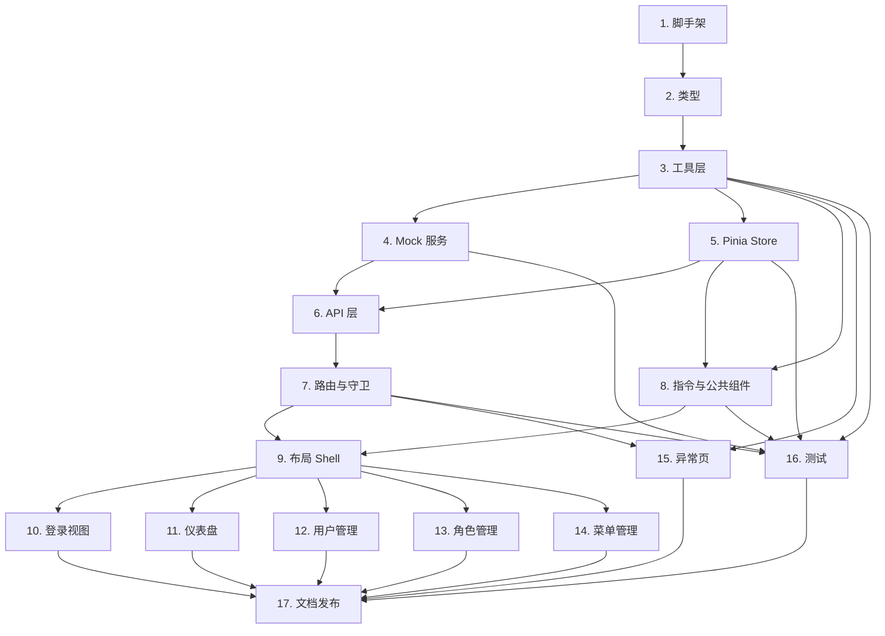

# Implementation Plan

## Overview

本任务清单依据 `requirements.md` 与 `design.md` 拆解，按「脚手架 → 类型 → 工具 → Mock → Store → API → Router → 指令/组件 → Layout → 业务视图 → 异常页 → 测试 → 文档」自下而上推进。每条子任务括注其覆盖的需求编号（_Requirements_）或设计属性（_Properties_）。

## Tasks

- [x] 1. 初始化工程脚手架与构建配置
  - [x] 1.1 创建 `package.json`（依赖、`dev/build/preview/lint/type-check/test` 脚本），写入 `.gitignore`、`LICENSE`（MIT）、`index.html`、`public/favicon.ico`
    - _Requirements: 1.1, 1.2, 1.3, 1.4, 1.5, 14.1, 14.2, 14.4, 15.4_
  - [x] 1.2 配置 `tsconfig.json`（strict、`@/*` 别名、include 自动生成 d.ts）与 `tsconfig.node.json`
    - _Requirements: 1.6, 1.9, 17.4_
  - [x] 1.3 编写 `vite.config.ts`：路径别名、端口、`vite-plugin-mock`（按 `VITE_USE_MOCK` 开关）、`unplugin-auto-import` + `@layui/unplugin-vue-components` + `LayuiVueResolver`
    - _Requirements: 1.9, 16.2, 16.8, 17.1, 17.2, 17.3, 17.4_
  - [x] 1.4 创建 `.env.development`、`.env.production`、`.env.example`，约定 `VITE_USE_MOCK`、`VITE_API_BASE_URL`、`VITE_PORT`、`VITE_PUBLIC_PATH`
    - _Requirements: 3.2, 16.8_
  - [x] 1.5 配置 ESLint（含 `eslint-plugin-vue`、`@typescript-eslint`）与 Prettier，并通过 `.eslintignore` / `.prettierignore` 排除自动生成的 `auto-imports.d.ts`、`components.d.ts`、`.eslintrc-auto-import.json`
    - _Requirements: 1.7, 14.1, 17.5_
  - [x] 1.6 建立 `src` 目录骨架：`api`、`assets`、`components`、`directives`、`hooks`、`layouts`、`router`、`store`、`styles`、`utils`、`views`、`types`，并落地 `App.vue`、`main.ts` 入口（含 layui-vue 全局注册与样式引入）
    - _Requirements: 1.8, 1.10_

- [x] 2. 共享类型与领域模型
  - [x] 2.1 编写 `src/types/api.d.ts`：`ApiResponse<T>`、`PageQuery`、`PageResult<T>`
    - _Requirements: 3.8, 16.4, 16.5_
  - [x] 2.2 编写 `src/types/domain.d.ts`：`Status`、`User`、`UserCreateRequest`、`UserUpdateRequest`、`Role`、`Permission`、`MenuType`、`Menu`、`LoginRequest`、`LoginResponse`、`UserMenusResponse`、`TabItem`
    - _Requirements: 7, 8, 9, 10_
  - [x] 2.3 编写 `src/types/env.d.ts` 与 `vue-router` 模块扩展（`RouteMeta`：title/icon/permission/keepAlive/hidden）
    - _Requirements: 5.7, 16.8_

- [x] 3. 基础工具层
  - [x] 3.1 实现 `src/utils/storage.ts`：JSON 序列化、`lva_` 前缀、local/session 双驱动、解析失败返回 `null` 并 DEV 打印
    - _Requirements: 13.1, 13.2, 13.3, 13.4_
    - _Properties: 3, 4_
  - [x] 3.2 实现 `src/utils/permission.ts`：`hasPermission(code)`、`SUPER_ADMIN_CODE` 常量、空入参返回 `true`、Super_Admin 永真
    - _Requirements: 10.3, 10.4_
    - _Properties: 6_
  - [x] 3.3 实现 `src/utils/theme.ts`：CSS 变量与 `<html>` 类名切换、写入 `--global-primary-color`
    - _Requirements: 11.2, 11.5_
  - [x] 3.4 实现 `src/utils/error-handler.ts`：`setupErrorHandler(app)`、DEV/PROD 分支、`unhandledrejection` 监听
    - _Requirements: 12.3, 12.4_
  - [x] 3.5 实现 `src/utils/http.ts`：axios 单例、Token 注入、15s 超时、业务码/401/5xx/超时/网络分支处理、`get/post/put/delete` 泛型封装
    - _Requirements: 2.9, 3.1, 3.2, 3.3, 3.4, 3.5, 3.6, 3.7, 3.8_
    - _Properties: 2_

- [x] 4. Mock 服务（TypeScript）
  - [x] 4.1 编写 `mock/_utils.ts`：`ok/fail/unauthorized/paginate/parseQuery/parseBody/requireToken/guard`
    - _Requirements: 16.1, 16.4, 16.5, 16.7_
    - _Properties: 8_
  - [x] 4.2 创建 `mock/_data/{users,roles,menus,permissions}.ts`，预置 `admin/123456`（Super_Admin）与 `user/123456`（Basic_User）
    - _Requirements: 16.6_
  - [x] 4.3 实现 `mock/auth.ts`：`/api/auth/login`、`/api/auth/logout`、`/api/auth/userInfo`、`/api/auth/menus`
    - _Requirements: 2.4, 2.5, 16.3, 16.6, 16.7_
  - [x] 4.4 实现 `mock/user.ts`：分页查询、增/改/删、重置密码
    - _Requirements: 7, 16.3, 16.5_
  - [x] 4.5 实现 `mock/role.ts`：分页、增/改/删、权限分配；编码重复返回 `40010`，被引用返回 `40020`
    - _Requirements: 8, 16.3_
  - [x] 4.6 实现 `mock/menu.ts`：树查询、分页、增/改/删
    - _Requirements: 9, 16.3_
  - [x] 4.7 实现 `mock/dashboard.ts`：用户数 / 角色数 / 菜单数 / 今日访问数四个统计接口
    - _Requirements: 6.2, 16.3_

- [x] 5. 状态管理（Pinia）
  - [x] 5.1 创建 `src/store/index.ts`（`createPinia`）与 `src/store/persist.ts`（与 `Storage_Service` 对接）
    - _Requirements: 13_
  - [x] 5.2 实现 `src/store/modules/user.ts`：`login/fetchUserInfo/fetchUserMenus/clearAuth/logout`
    - _Requirements: 2.5, 2.7_
    - _Properties: 1_
  - [x] 5.3 实现 `src/store/modules/permission.ts`：`generateRoutes`（按权限过滤 + `addRoute`）、`reset`
    - _Requirements: 5.3, 5.6_
  - [x] 5.4 实现 `src/store/modules/app.ts`：`theme/primary/sidebarCollapsed/tabs` + 对应 actions（含 `closeTabReducer` 纯函数抽离）
    - _Requirements: 4.4, 4.6, 4.7, 4.8, 4.9, 11.1, 11.2, 11.3, 11.4, 11.5_
    - _Properties: 9_

- [x] 6. 业务 API 层
  - [x] 6.1 `src/api/auth.ts`：`login/logout/getUserInfo/getUserMenus`
    - _Requirements: 2.4, 2.5, 2.7_
  - [x] 6.2 `src/api/user.ts`：`getUserPage/createUser/updateUser/deleteUser/resetUserPassword`
    - _Requirements: 7_
  - [x] 6.3 `src/api/role.ts`：分页、CRUD、`getRolePermissions/saveRolePermissions`
    - _Requirements: 8_
  - [x] 6.4 `src/api/menu.ts`：`getMenuTree/getMenuPage/createMenu/updateMenu/deleteMenu`
    - _Requirements: 9_
  - [x] 6.5 `src/api/dashboard.ts`：四个统计接口
    - _Requirements: 6.2_

- [x] 7. 路由与守卫
  - [x] 7.1 编写 `src/router/routes.static.ts`：`/login`、`/403`、`/404`、`/500`、`/redirect/:path(.*)`、404 兜底
    - _Requirements: 5.2, 12.1_
  - [x] 7.2 编写 `src/router/routes.async.ts`：基于 `BasicLayout` 的动态路由树（dashboard、system/user、system/role、system/menu）
    - _Requirements: 5.2, 5.3, 6.1_
  - [x] 7.3 抽出纯函数 `decideNavigation(...)` 至 `src/router/guard.ts`，覆盖白名单/未登录/未注册/无权限/通过五条分支
    - _Requirements: 2.8, 5.4, 5.5_
    - _Properties: 7_
  - [x] 7.4 在 `src/router/index.ts` 装配 `createRouter` + `beforeEach`（接 `decideNavigation`）+ `afterEach`（更新 `document.title`）
    - _Requirements: 5.1, 5.7_
  - [x] 7.5 实现 `resetRouter`：登出时移除全部动态路由
    - _Requirements: 5.6_

- [x] 8. 指令与公共组件
  - [x] 8.1 实现 `src/directives/permission.ts`：`mounted/updated` 双钩子，与 `hasPermission` 等价
    - _Requirements: 10.1, 10.2_
    - _Properties: 5_
  - [x] 8.2 在 `main.ts` 注册 `v-permission`、Pinia、Router、错误处理器
    - _Requirements: 10.1, 12.3_
  - [x] 8.3 实现公共组件 `SearchForm`、`PageTable`、`PermissionTree`、`IconSelect`
    - _Requirements: 7.2, 7.3, 8.5, 9.2_

- [x] 9. 布局与 Shell
  - [x] 9.1 实现 `src/layouts/BlankLayout.vue`（登录与异常页用）
    - _Requirements: 2.1, 12.1_
  - [x] 9.2 实现 `src/layouts/BasicLayout.vue`（Header / Sidebar / Main 三栏）
    - _Requirements: 4.1_
  - [x] 9.3 实现 `Header.vue`（系统名 + 折叠按钮 + 主题切换 + 用户下拉）与 `UserDropdown.vue`（个人中心 / 修改密码 / 退出登录）、`ThemeSwitcher.vue`
    - _Requirements: 4.2, 11.2, 11.4_
  - [x] 9.4 实现 `Sidebar.vue` + `SidebarItem.vue`：按 menus 渲染、240/64 折叠、768px 自动折叠
    - _Requirements: 4.3, 4.4, 4.9_
  - [x] 9.5 实现 `Breadcrumb.vue`：基于 `route.matched` 过滤渲染
    - _Requirements: 4.5_
  - [x] 9.6 实现 `TabsView.vue`：新增/切换/关闭（含唯一标签隐藏关闭图标）
    - _Requirements: 4.6, 4.7, 4.8_
    - _Properties: 9_

- [x] 10. 登录与认证视图
  - [x] 10.1 `src/views/login/index.vue`：账号 / 密码字段、空值校验、按钮 loading、登录 10s 超时文案
    - _Requirements: 2.1, 2.2, 2.3, 2.4, 2.10_
  - [x] 10.2 登录成功后写入 token/user → 拉取 menus → 注册动态路由 → `replace(redirect ?? '/dashboard')`；登录失败 toast 后端 message
    - _Requirements: 2.5, 2.6_
  - [x] 10.3 登出动作：清 token/user/permissions、`resetRouter`、跳转 `/login`
    - _Requirements: 2.7_
    - _Properties: 1_

- [x] 11. 仪表盘
  - [x] 11.1 `src/views/dashboard/index.vue`：欢迎语 + 当前日期 + 四个统计卡片 + 骨架屏占位
    - _Requirements: 6.1, 6.2, 6.3_
  - [x] 11.2 单卡片失败展示「加载失败，点击重试」并支持单独重试
    - _Requirements: 6.4_

- [x] 12. 用户管理
  - [x] 12.1 列表页：账号/昵称/状态筛选 + 分页（10/20/50）
    - _Requirements: 7.1, 7.2, 7.3_
  - [x] 12.2 `UserFormDialog`：新增 / 编辑（编辑模式不显示密码）、账号正则 `^[A-Za-z0-9_]{4,20}$`、字段级错误提示
    - _Requirements: 7.4, 7.5, 7.6, 7.7_
  - [x] 12.3 重置密码（二次确认）、删除（二次确认）、当前用户行隐藏删除
    - _Requirements: 7.8, 7.9, 7.10_
    - _Properties: 10_

- [x] 13. 角色管理
  - [x] 13.1 列表页：编码 / 名称 / 描述 / 状态 / 创建时间 / 操作列
    - _Requirements: 8.1, 8.2_
  - [x] 13.2 `RoleFormDialog`：新增 / 编辑；接口返回 `40010` 时定位编码字段提示「角色编码已存在」
    - _Requirements: 8.3, 8.4_
  - [x] 13.3 `RolePermissionDialog` + `PermissionTree`：默认勾选当前权限、保存后提示
    - _Requirements: 8.5, 8.6_
  - [x] 13.4 删除：二次确认；后端返回 `40020` 时提示「该角色正在被使用，无法删除」
    - _Requirements: 8.7, 8.8_

- [x] 14. 菜单管理
  - [x] 14.1 树形表格：层级展示菜单字段；新增/在子项下新增弹出表单
    - _Requirements: 9.1, 9.2, 9.3_
  - [x] 14.2 `MenuFormDialog`：按 `directory/menu/button` 三种类型的差异化校验
    - _Requirements: 9.4, 9.5_
  - [x] 14.3 保存后：刷新树 + 触发 `useUserStore.fetchUserMenus()` 重建左侧导航
    - _Requirements: 9.6_
  - [x] 14.4 删除：本地拦截存在子节点的删除，提示「请先删除其子节点」
    - _Requirements: 9.7_

- [x] 15. 异常页与全局错误
  - [x] 15.1 实现 `views/error/{403,404,500}.vue`：错误说明 + 「返回首页」按钮跳转 `/dashboard`
    - _Requirements: 12.1, 12.2_
  - [x] 15.2 在 `main.ts` 中接入 `setupErrorHandler(app)` 并验证 DEV/PROD 行为
    - _Requirements: 12.3, 12.4_
  - [x] 15.3 实现 `views/redirect/index.vue` 用于路由刷新
    - _Requirements: 5.2_

- [ ] 16. 测试基础设施与属性测试
  - [x] 16.1 配置 `vitest.config.ts`、`tests/setup.ts`、`fast-check`、`axios-mock-adapter`、`@vue/test-utils`
    - _Requirements: 14.1, 14.2_
  - [x] 16.2 `tests/properties/storage.property.test.ts`（Property 3、4）
    - _Properties: 3, 4_
  - [x] 16.3 `tests/properties/permission.property.test.ts`（Property 5、6）
    - _Properties: 5, 6_
  - [x] 16.4 `tests/properties/auth.property.test.ts`（Property 1、2）
    - _Properties: 1, 2_
  - [x] 16.5 `tests/properties/router-guard.property.test.ts`（Property 7）
    - _Properties: 7_
  - [x] 16.6 `tests/properties/mock.property.test.ts`（Property 8）
    - _Properties: 8_
  - [x] 16.7 `tests/properties/tabs.property.test.ts`（Property 9）
    - _Properties: 9_
  - [x] 16.8 `tests/properties/user-row.property.test.ts`（Property 10）
    - _Properties: 10_
  - [x] 16.9 边界单元测试：登录交互、`UserFormDialog` 编辑模式、路由标题、主题切换、`errorHandler`
    - _Requirements: 2, 4, 7, 11, 12_

- [x] 17. 文档与发布
  - [x] 17.1 编写中文 `README.md`：项目简介、技术栈、目录结构、本地开发、构建部署、Git Conventional Commits 约定、双仓地址、layui-vue 入门链接
    - _Requirements: 14.3, 15.1, 15.2, 15.3_
  - [x] 17.2 项目本地构建与类型检查通过（`npm run type-check && npm run lint && npm run test && npm run build`）
    - _Requirements: 1.5, 14.1, 14.2_

- [x] 18. 登录/注册 5 套布局模板
  - [x] 18.1 新增 `src/types/auth-template.d.ts`：`AuthTemplateKey` 联合类型与 `AUTH_TEMPLATE_OPTIONS` 常量；扩展 `staticRoutes` 加入 `/register`，并把 `/register` 加入 `WHITELIST`
    - _Requirements: 18.1, 18.2, 18.3, 18.7_
  - [x] 18.2 实现 `src/views/auth/components/AuthTemplateSelector.vue`：基于 `<lay-select>`，v-model `AuthTemplateKey`，使用 `AUTH_TEMPLATE_OPTIONS` 默认渲染
    - _Requirements: 18.3, 18.4_
  - [x] 18.3 实现 5 套模板组件：`CenteredCardTemplate.vue` / `SplitLeftIllustrationTemplate.vue` / `SplitRightIllustrationTemplate.vue` / `FullscreenBgTemplate.vue` / `TopBannerTemplate.vue`，仅做版式 + `<slot name="form" />`，模板间样式互不复用
    - _Requirements: 18.1, 18.2_
  - [x] 18.4 实现 `src/views/auth/AuthFrame.vue`：右上角 selector + 通过 `<component :is>` 渲染当前模板；表单实例由调用方通过 `<template #form>` 注入，模板切换不重建表单实例（满足 Property 11）
    - _Requirements: 18.4, 18.10_
    - _Properties: 11_
  - [x] 18.5 实现 `LoginForm.vue` / `RegisterForm.vue`：完整字段、校验（账号 `^[A-Za-z0-9_]{4,20}$`、密码 6–20、确认密码相等校验）、底部「立即注册 / 立即登录」跳转链接
    - _Requirements: 18.8, 18.9_
  - [x] 18.6 重写 `src/views/login/index.vue`：使用 `AuthFrame` + `<LoginForm />`，从 `storage.get('auth_login_template')` 读取初值，切换时写回；视口 `<768px` 自动把双栏模板降级为 `centered-card`（仅渲染层降级，不修改持久化值）
    - _Requirements: 18.5, 18.6_
  - [x] 18.7 新增 `src/views/auth/Register.vue` + `src/api/auth.ts` 增加 `register(payload)`；mock `auth.ts` 增加 `POST /api/auth/register`（用户名查重、写入 mock 数据；返回 `LoginResponse`）
    - _Requirements: 18.7, 18.8_
  - [ ] 18.8 属性测试 `tests/properties/auth-template.property.test.ts`（Property 11：模板切换不丢失表单状态）
    - _Properties: 11_

- [x] 19. HTTP 客户端高级能力（重构 utils/http）
  - [x] 19.1 拆分 `src/utils/http/` 子目录：`core.ts` 创建 axios 实例 + 默认配置；`types.ts` 定义 `RequestConfig` / `RetryOptions` / `CacheOptions` / `HttpError`；`public.ts` 暴露 `http.get/post/put/delete/raw`，保持 `import { http } from '@/utils/http'` 旧路径继续可用（同名 re-export）
    - _Requirements: 19.9_
  - [x] 19.2 `interceptors/auth.ts` 注入 Authorization；`interceptors/cancel.ts` 基于 AbortController + tag 实现 `cancelByTag(tag)` / `cancelAll()`；默认未指定 tag 的请求挂到 `'route'` tag
    - _Requirements: 19.4_
    - _Properties: 14_
  - [x] 19.3 `interceptors/dedupe.ts` 进行中请求复用（GET/HEAD 默认开启）；`interceptors/cache.ts` LRU(100) + TTL，提供 `cacheInvalidate(tags?)`
    - _Requirements: 19.3, 19.5_
    - _Properties: 12_
  - [x] 19.4 `interceptors/retry.ts` 重试 + 指数退避 + per-request `retryOn`
    - _Requirements: 19.1, 19.2_
    - _Properties: 13_
  - [x] 19.5 `interceptors/progress.ts` nprogress + 计数器；`silent` 请求不计入也不弹错误；`interceptors/error.ts` 401/5xx/网络/超时归一化（与现有 layer.msg 行为兼容）
    - _Requirements: 19.6_
  - [x] 19.6 `interceptors/refresh.ts` 401 → `/auth/refresh` 单飞 + 重放；mock `auth.ts` 增加 `POST /api/auth/refresh`，登录响应增加 `refreshToken` 字段；`useUserStore` 同步存取 `refreshToken`
    - _Requirements: 19.7_
  - [x] 19.7 在 `router/index.ts` 的 `beforeEach` 起始处调用 `cancelByTag('route')`；并在 `useUserStore.logout` 中触发 `cancelAll()` + `cacheInvalidate()`
    - _Requirements: 19.4_
  - [ ] 19.8 属性测试：`tests/properties/http-cache.property.test.ts`（Property 12）、`http-retry.property.test.ts`（Property 13）、`http-cancel.property.test.ts`（Property 14）
    - _Properties: 12, 13, 14_

- [x] 20. 国际化（i18n）
  - [x] 20.1 安装 `vue-i18n@^9`；`src/locales/{index.ts, zh-CN.ts, en-US.ts}` 与 `setLocale(code)`；`main.ts` 装配 i18n
    - _Requirements: 20.1, 20.3_
  - [x] 20.2 Header 增加语言切换器组件 `LocaleSwitcher.vue`，写入 `lva_locale` 持久化
    - _Requirements: 20.2, 20.3_
  - [x] 20.3 菜单与表单文案改造：`Sidebar/SidebarItem` 与 `Breadcrumb` 在渲染 title 时若以 `i18n:` 起始则调 `t(key)`；常见错误提示与按钮文案抽到词典
    - _Requirements: 20.4, 20.5_

- [x] 21. 通知中心
  - [x] 21.1 mock：`mock/_data/notices.ts` 与 `mock/notice.ts`；接口：`GET /api/notice/list`、`PUT /api/notice/:id/read`、`PUT /api/notice/read-all`、`GET /api/notice/unread-count`
    - _Requirements: 21.3_
  - [x] 21.2 api：`src/api/notice.ts` 对应封装
    - _Requirements: 21.3_
  - [x] 21.3 `src/layouts/components/NotificationCenter.vue`：铃铛 + 徽章 + 三 tab 列表 + 单条/全部已读 + 空态占位 + 60s polling
    - _Requirements: 21.1, 21.2, 21.4, 21.5_
  - [x] 21.4 在 `Header.vue` 中接入 NotificationCenter
    - _Requirements: 21.1_

- [x] 22. 设置抽屉 / 锁屏 / 水印 / 视觉模式
  - [x] 22.1 `useAppStore` 扩展：`layoutMode/visualMode/watermark/locked` + 对应 actions（含 `lock/unlock`），全部写入 storage（除 `locked` 之外，`locked` 仅运行期）
    - _Requirements: 22.3, 22.4_
  - [x] 22.2 `src/layouts/components/SettingsDrawer.vue`：右侧抽屉，分组「布局/主题/界面/安全」；接入到 Header 齿轮按钮
    - _Requirements: 22.1, 22.2_
  - [x] 22.3 `BasicLayout.vue` 支持三种 LayoutMode：`side`（现有）、`top`（顶部 nav + 全宽内容）、`mix`（顶部 nav + 二级 sidebar）；视口 < 768px 强制锁定 `side`
    - _Requirements: 22.7_
  - [x] 22.4 视觉模式：`src/styles/visual.scss` + `applyVisual(mode)` 切换 `<html>` 类名 `visual-weak` / `visual-gray`
    - _Requirements: 22.5_
  - [x] 22.5 锁屏：`src/layouts/components/LockScreen.vue` 全屏遮罩 + 密码框；登录成功时 sessionStorage 暂存密码以供 mock 校验，登出清除
    - _Requirements: 22.4_
  - [x] 22.6 水印：`src/utils/watermark.ts` canvas 实现 + `<Watermark>` 组件包装；在 `BasicLayout.vue` 主内容区根据 `appStore.watermark.enabled` 渲染
    - _Requirements: 22.6_

- [x] 23. 通用 Hooks 与字典
  - [x] 23.1 `src/hooks/useTable.ts`：返回 `{ list, total, loading, page, pageSize, query, search, reset, refresh, remove }`，page/pageSize/query 变更自动 reload
    - _Requirements: 23.1_
  - [x] 23.2 `src/hooks/useDict.ts`：调 `/api/dict/:code`（cache tag=['dict']），返回 `{ items, label }`
    - _Requirements: 23.2_
  - [x] 23.3 `src/hooks/useEcho.ts`：批量 id 聚合查询；`src/hooks/useDownload.ts`：Blob → a 链接 + 进度回调
    - _Requirements: 23.3, 23.4_
  - [x] 23.4 `src/api/dict.ts` + `mock/dict.ts` + `mock/_data/dicts.ts`：至少 `status` 与 `menuType` 两类字典
    - _Requirements: 23.5_

- [x] 24. 文件上传与 Excel 导入导出
  - [x] 24.1 `src/components/FileUpload/index.vue`：包装 `<lay-upload>`，扩展大小/扩展名校验、进度回调；`src/api/upload.ts` 与 `mock/upload.ts`
    - _Requirements: 24.1_
  - [x] 24.2 添加 `xlsx@^0.20.x` 依赖；`src/utils/excel.ts` 提供 `exportExcel(rows, columns, fileName)` 与 `importExcel(file, schema)`
    - _Requirements: 24.2, 24.3_
  - [x] 24.3 用户列表页接入「导出」按钮（演示导出能力）
    - _Requirements: 24.4_

## Task Dependency Graph

```json
{
  "waves": [
    { "wave": 1, "tasks": ["1"] },
    { "wave": 2, "tasks": ["2"] },
    { "wave": 3, "tasks": ["3"] },
    { "wave": 4, "tasks": ["4", "5"] },
    { "wave": 5, "tasks": ["6", "8"] },
    { "wave": 6, "tasks": ["7"] },
    { "wave": 7, "tasks": ["9", "15"] },
    { "wave": 8, "tasks": ["19", "20"] },
    { "wave": 9, "tasks": ["18", "21", "22", "23", "24"] },
    { "wave": 10, "tasks": ["10", "11", "12", "13", "14"] },
    { "wave": 11, "tasks": ["16"] },
    { "wave": 12, "tasks": ["17"] }
  ],
  "dependencies": {
    "1": [],
    "2": ["1"],
    "3": ["2"],
    "4": ["3"],
    "5": ["3"],
    "6": ["4", "5"],
    "7": ["6"],
    "8": ["3", "5"],
    "9": ["7", "8"],
    "10": ["9", "18", "20"],
    "11": ["9", "23"],
    "12": ["9", "23", "24"],
    "13": ["9", "23"],
    "14": ["9", "23"],
    "15": ["3", "7"],
    "16": ["3", "4", "5", "7", "8", "19"],
    "17": ["10", "11", "12", "13", "14", "15", "16", "18", "19", "20", "21", "22", "23", "24"],
    "18": ["7", "8", "20"],
    "19": ["3", "5", "6"],
    "20": ["3", "5"],
    "21": ["6", "9"],
    "22": ["5", "9", "20"],
    "23": ["6", "19"],
    "24": ["6", "9"]
  }
}
```



## Notes

- **执行顺序**：依赖图从下往上推进；同层无依赖任务可并行（例如 11 / 12 / 13 / 14 在 9、6 完成后并行）。
- **Mock 与真实接口同构**：`mock/*.ts` 中接口路径、请求体、响应壳与生产期保持一致，切换 `VITE_USE_MOCK` 即可在本地 Mock 与真实后端之间无缝切换。
- **属性测试**：每个 `Property N` 在 `tests/properties/` 下对应一个文件，`fast-check` 默认 100 次迭代；可用 `FC_NUM_RUNS=1000` 加深验证。
- **类型契约**：`src/types/domain.d.ts` 与 `mock/_data/*.ts` 共享同一份字段定义，避免视图层手写裸对象。
- **质量门禁**：`npm run type-check && npm run lint && npm run test && npm run build` 必须全部通过后才进入 17.2。
